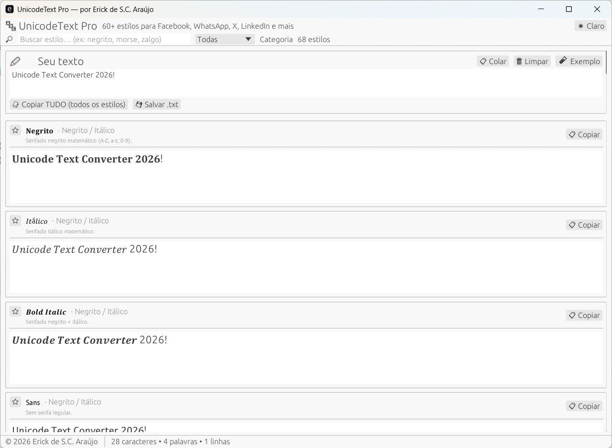

# 🔤 UnicodeText Pro

**Conversor de texto Unicode estilizado para redes sociais**


Funciona no **Facebook, WhatsApp, X (Twitter), LinkedIn, Instagram, Discord** e qualquer lugar que aceite Unicode. Roda **100% offline**, sem conta e sem internet.



---

## ✨ Funcionalidades

- **60+ estilos** em 9 categorias: negrito/itálico matemático, caligrafia e gótico, circulados/quadrados, espelhados, riscados, molduras, formatação, codificadores e diversão
- **Prévia instantânea** de todos os estilos enquanto você digita
- **Copiar com 1 clique** por estilo, ou **copiar tudo** de uma vez
- **Busca e filtro** por nome, categoria e descrição
- **Favoritos** ★ para seus estilos preferidos
- **Modo claro / escuro**
- **Exportar** todas as conversões para `.txt`
- **Modo CLI** para uso em terminal e scripts
- **Executável único `.exe`**, sem instalador e sem dependências

## 🖥️ Como usar

### Interface gráfica

1. Baixe o `UnicodeTextPro.exe` e dê duplo clique (não abre nenhuma janela do cmd).
2. Digite ou cole seu texto (botão **📋 Colar**).
3. Clique em **📋 Copiar** no estilo desejado e cole onde quiser.

### Linha de comando

```cmd
UnicodeTextPro.exe --help
UnicodeTextPro.exe --list
UnicodeTextPro.exe --style bold "freeware 2026"
UnicodeTextPro.exe --all "freeware 2026"
UnicodeTextPro.exe "texto direto vira todos os estilos"
```

Exemplos de saída para `freeware`:

| Estilo | Resultado |
|---|---|
| Negrito | 𝐟𝐫𝐞𝐞𝐰𝐚𝐫𝐞 |
| Gótico | 𝔣𝔯𝔢𝔢𝔴𝔞𝔯𝔢 |
| Circulado | ⓕⓡⓔⓔⓦⓐⓡⓔ |
| Quadrado | 🄵🅁🄴🄴🅆🄰🅁🄴 |
| De ponta-cabeça | ǝɹɐʍǝǝɹɟ |
| Morse | ··−· ·−· · · ·−− ·− ·−· · |
| Leet | fr33w4r3 |

## 📥 Instalação

Nada para instalar: baixe o `UnicodeTextPro.exe` da seção de releases e execute. O programa é portátil.

## 👨‍💻 Autor

**Desenvolvido por Erick de S.C. Araújo** — © 2026. Todos os direitos reservados.

## 📄 Licença

Distribuído sob a licença **MIT**.
